p0# Deployment d5

CamHD P1 _rev2_ was installed by ROV Jason at ~1AM PT on 4 July 2018.   After an initial checkout, the regular 8/day sampling routine was re-instantiated.  This page describes the _non-standard_ videos produced during this deployment.

<table>
  <tr>
    <td>CAMHDA301-20180704T091500</td>
    <td>Initial video.  This was a "regularly scheduled" recording which coincided with the installation of the camera.   Video starts approx 3:30 into the video.</td>
  </tr>
  <tr>
    <td>CAMHDA301-20180704T095500</td>
    <td>Extended length "manual" recording while doing instrument checkout.
  </tr>
  <tr>
    <td>CAMHDA301-20180704T121500, CAMHDA301-20180704T151500</td>
    <td>Regularly scheduled runs, but only the right light is on -- leftover from last fall when previous system had ground faults.</td>
  </tr>
  <tr>
    <td>CAMHDA301-20180704T181500</td>
    <td>First of the regularly scheduled videos with both lights.</td>
  </tr>
  <tr>
    <td>CAMHDA301-20180706T001500, CAMHDA301-20180706T031500, CAMHDA301-20180706T061500 </td>
    <td>Stuck process on decode computer, video not coming on.
</table>

<table>
  <tr>
    <th>Region</th>
    <th>Reference from D2</th>
    <th>Reference from D4</th>
    <th>As deployed (from _CAMHDA301-20180705T211500_)</th>
  </tr>
  <tr>
    <td>d5_p1_z0</td>
    <td></td>
    <td>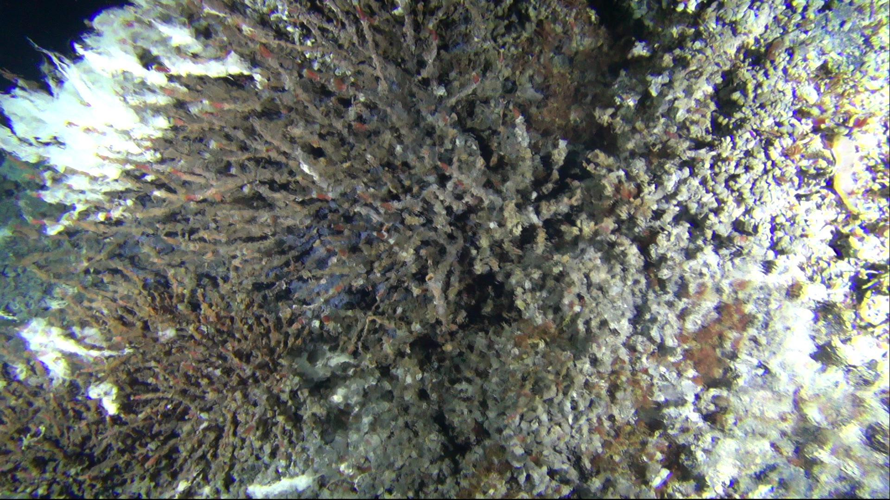</td>
    <td>
  </tr>
  <tr>
    <td>d5_p1_z1</td>
    <td>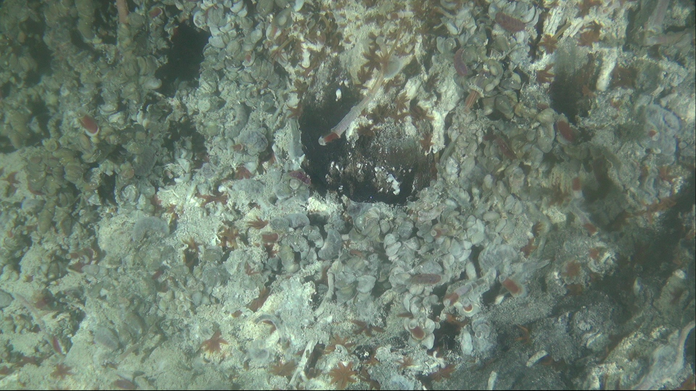</td>
    <td></td>
    <td>
  </tr>
  <tr>
    <td>d5_p0_z0</td>
    <td>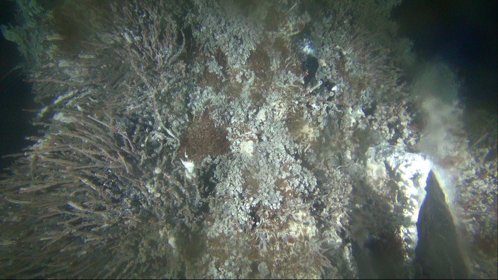</td>
    <td></td>
    <td>
  </tr>
  <tr>
    <td>d5_p2_z0</td>
    <td></td>
    <td>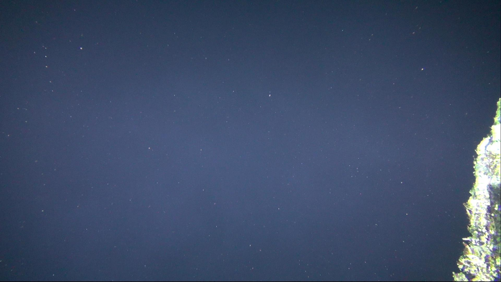</td>
    <td>
  </tr>
  <tr>
    <td>d5_p2_z1</td>
    <td>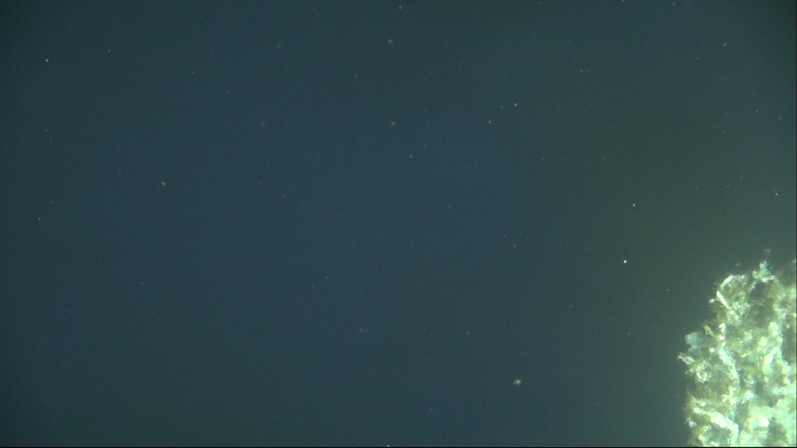</td>
    <td></td>
    <td>
  </tr>
  <tr>
    <td>d5_p3_z0</td>
    <td></td>
    <td></td>
    <td>
  </tr>
  <tr>
    <td>d5_p3_z1</td>
    <td>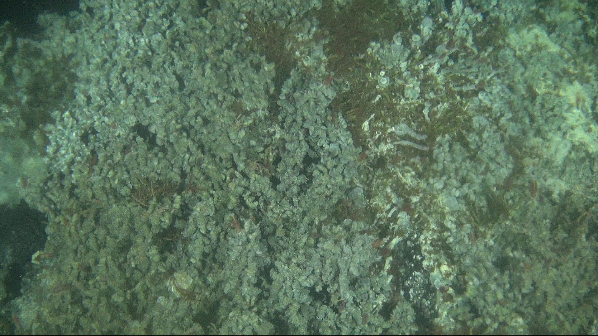</td>
    <td></td>
    <td>
  </tr>
  <tr>
    <td>d5_p3_z2</td>
    <td>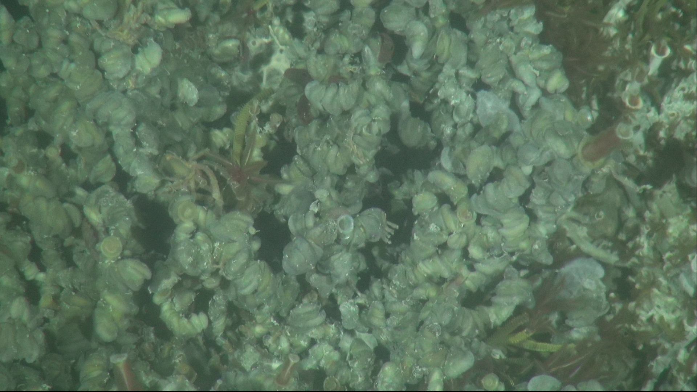</td>
    <td>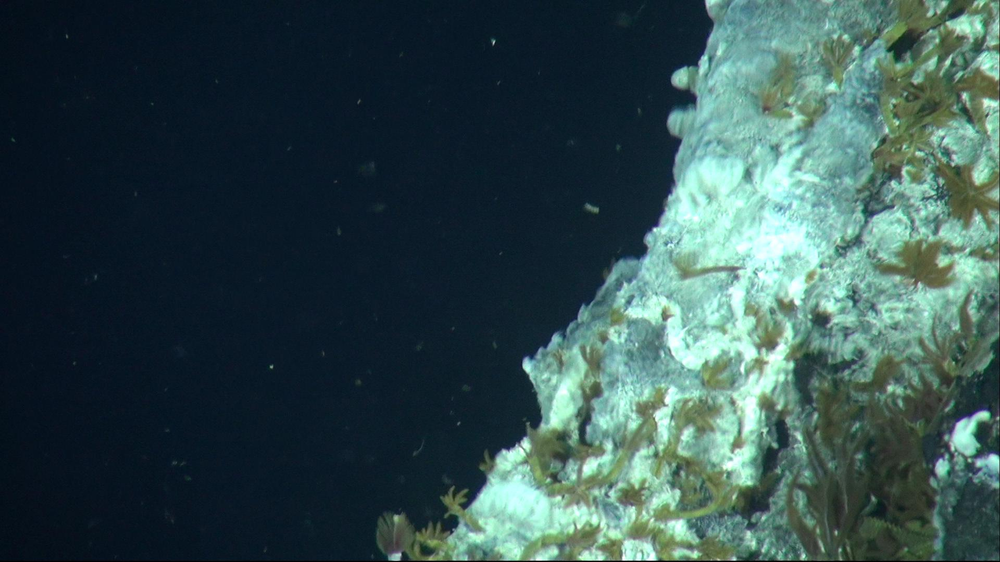</td>
    <td>
  </tr>
  <tr>
    <td>d5_p4_z0</td>
    <td></td>
    <td>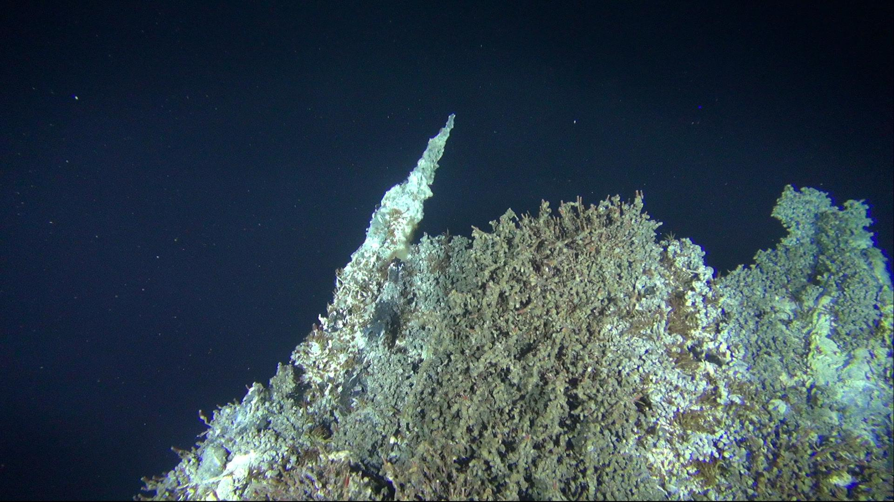</td>
    <td>
  </tr>
  <tr>
    <td>d5_p4_z1</td>
    <td></td>
    <td>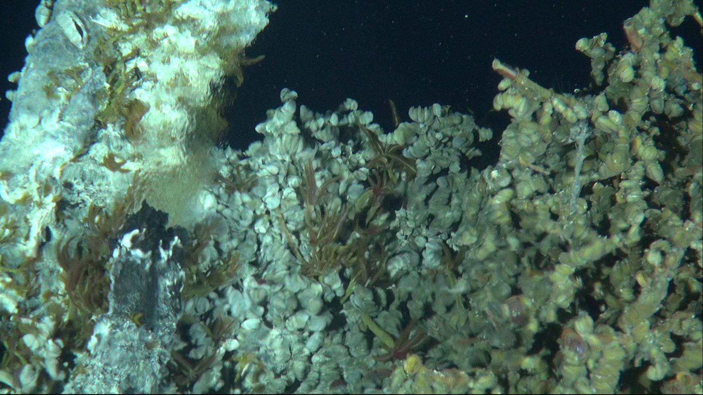</td>
    <td>
  </tr>
  <tr>
    <td>d5_p4_z2</td>
    <td></td>
    <td></td>
    <td>
  </tr>
  <tr>
    <td>d5_p5_z0</td>
    <td>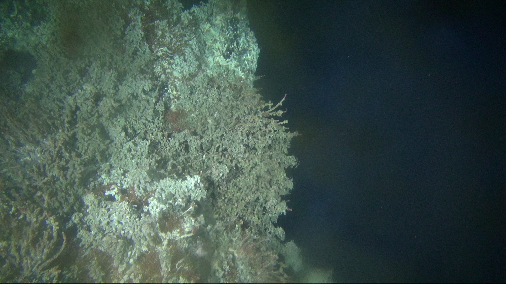</td>
    <td></td>
    <td>
  </tr>
  <tr>
    <td>d5_p5_z1</td>
    <td></td>
    <td>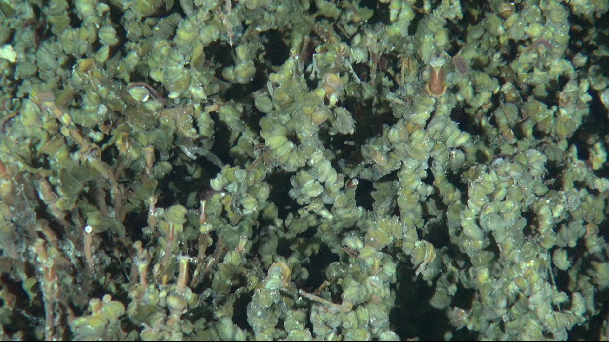</td>
    <td>
  </tr>
  <tr>
    <td>d5_p5_z2</td>
    <td></td>
    <td></td>
    <td>
  </tr>
  <tr>
    <td>d5_p6_z0</td>
    <td></td>
    <td></td>
    <td>
  </tr>
  <tr>
    <td>d5_p6_z1</td>
    <td></td>
    <td>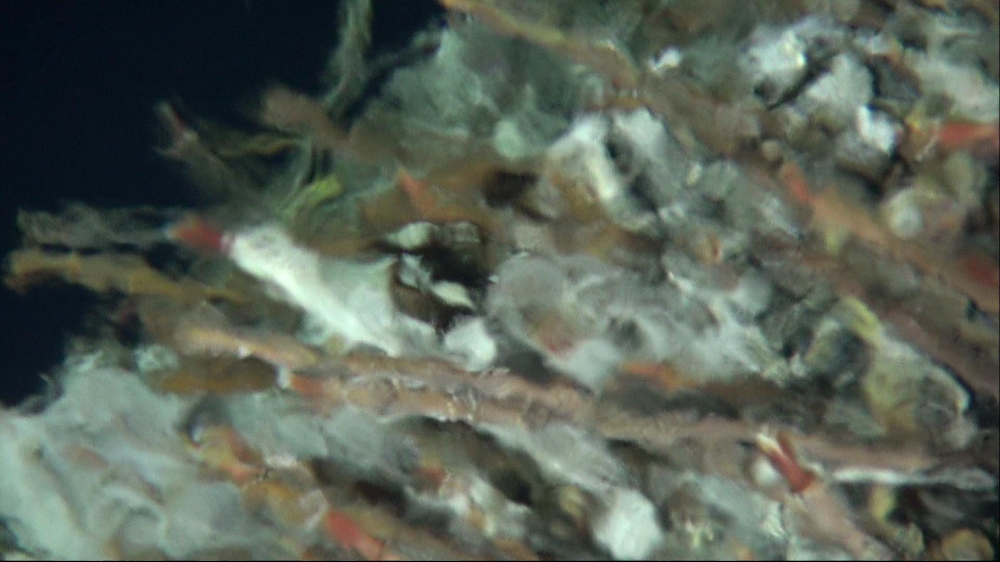</td>
    <td>
  </tr>
  <tr>
    <td>d5_p6_z2</td>
    <td></td>
    <td></td>
    <td>
  </tr>
  <tr>
    <td>d5_p0_z0</td>
    <td></td>
    <td></td>
    <td>
  </tr>
  <tr>
    <td>d5_p0_z1</td>
    <td>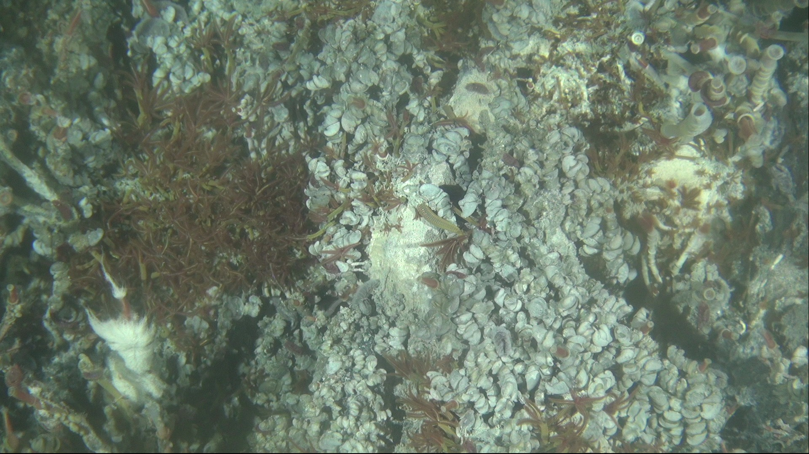</td>
    <td></td>
    <td>
  </tr>
  <tr>
    <td>d5_p0_z2</td>
    <td></td>
    <td></td>
    <td>
  </tr>
  <tr>
    <td>d5_p7_z0</td>
    <td></td>
    <td>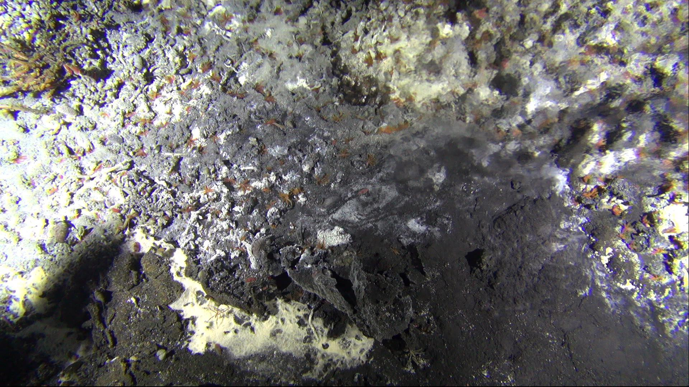</td>
    <td>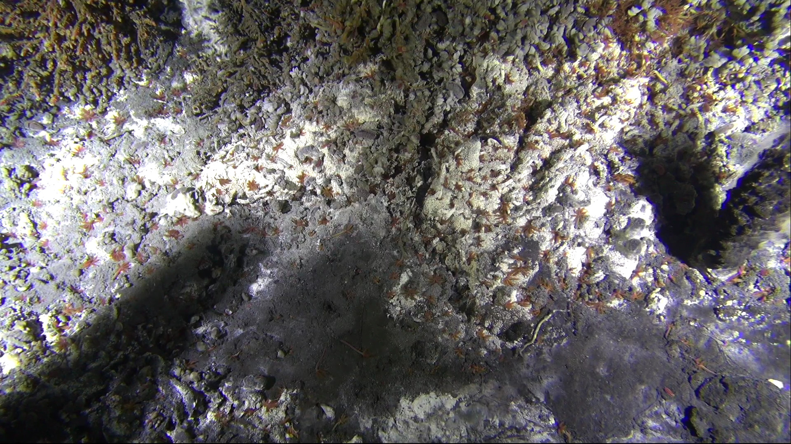
  </tr>
  <tr>
    <td>d5_p7_z1</td>
    <td></td>
    <td>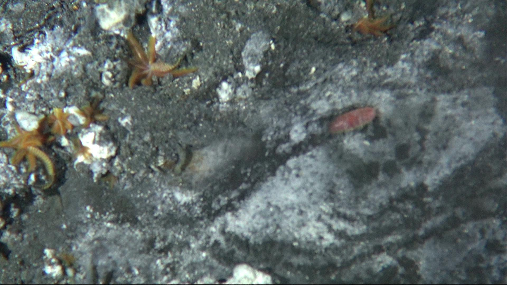</td>
    <td>
  </tr>
  <tr>
    <td>d5_p8_z0</td>
    <td></td>
    <td></td>
    <td>
  </tr>
  <tr>
    <td>d5_p8_z1</td>
    <td></td>
    <td>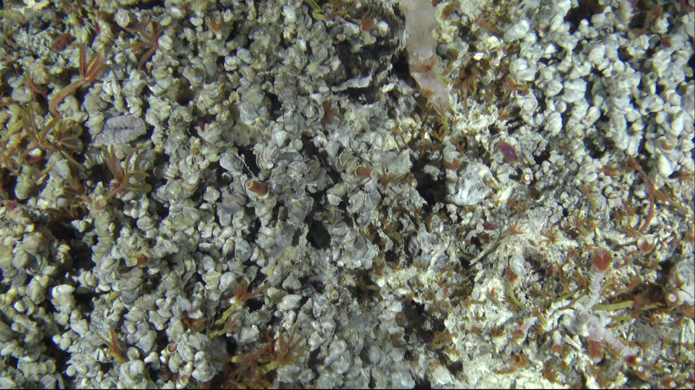</td>
    <td>
  </tr>
<table>
