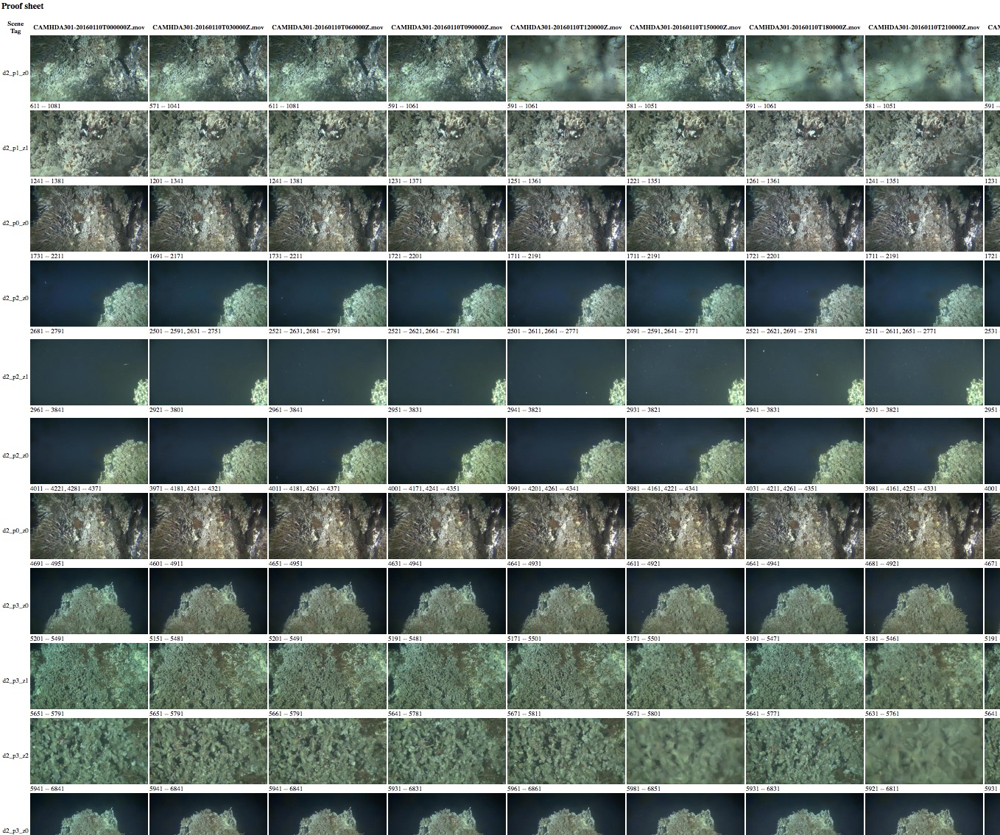
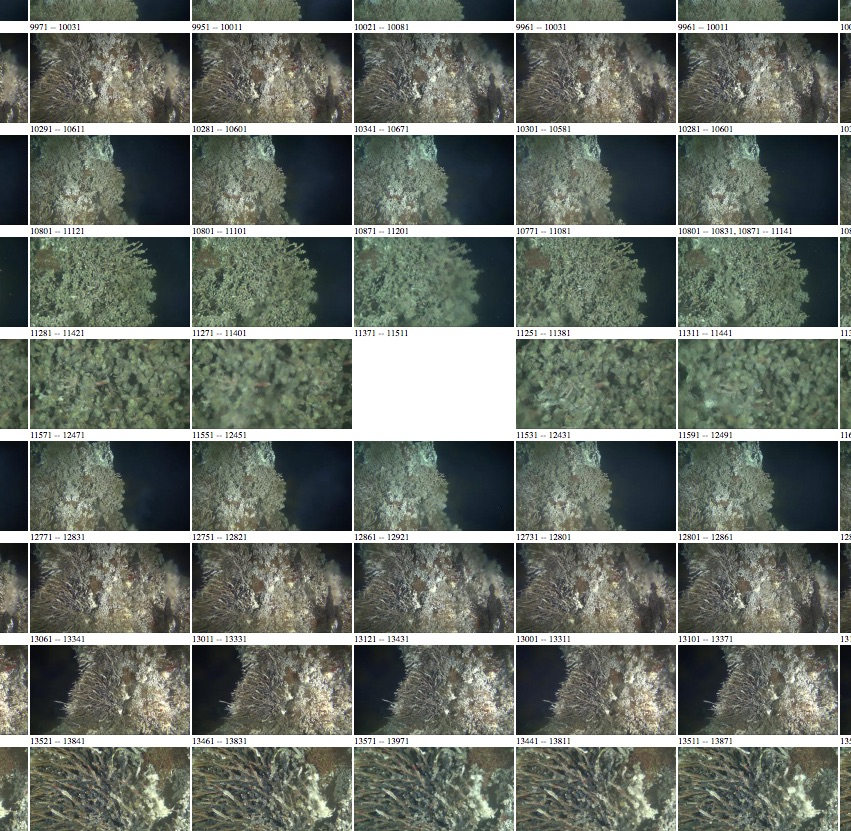
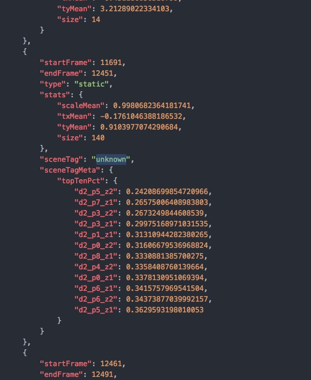

# Tools for validating region labels

The script [`script/make_regions_proof_sheet.py`](../script/make_regions_proof_sheet.py) can be used to make a "Proof Sheet," an HTML page which shows a thumnbnail image from
each labelled static region in a set of files.

Each column is one video file, and each row is one static scene label.   The script only deals with static regions (times when the camera isn't moving), and will always keep the regions within a file (the columns) in chronological order _except for regions which haven't labelled, which appear at the bottom of the page_.  To make the table the script attempts to line up sequences of regions which appear to multiple files.   This can make it straightforward to identify regions which are missing or have been incorrectly labelled.  For example, in this case, the region in a video could not be labelled at all (as opposed to mis-labelled), so it doesn't appear in the sequence, and you get a hole in the web page.

When the labelling of static regions in two files doesn't agree, it will attempt to rectify the situation by inserting blank space (in cases where one file has a particular region, but it has been missed or skipped in the other).

Unlabelled static regions are gathered at the bottom of the page.

# Correcting regions files

As the region files are JSON (just a text file), they can be correct by hand.  For example, in the pictures  above, the static region somewhere between frames 11511 and 12861 (the small numbers beneath the images) has not been labelled.      This can be manually corrected by first figuring out which
regions file is affected (scroll to the top of the proof sheet), opening the relevant regions
file in a text editor, and finding the relevant static section:

The unlabelled section can be seen in the middle of the image.   The word `"unknown"` can be changed
to the correct label, and the file saved.   Work can be checked by re-creating the proof sheet and reloading it in the web browser.

# Running the script

The script is written in Python.   You provide `_regions.json` files
as an input and it makes an HTML file.   This works best if you use standard Unix-y
wildcards (`*`) --- if you give it a directory it will process all of the regions.json
files inside of it.

For example, to make a proof sheet of all of the videos from Feb 15th, 2017, you might run (from the top level of this repo):

    python scripts/make_regions_proof_sheets RS03ASHS/PN03B/06-CAMHDA301/2017/02/15/*_regions.json

or equivalently

  python scripts/make_regions_proof_sheets RS03ASHS/PN03B/06-CAMHDA301/2017/02/15/

To do two days, you could do:

    python scripts/make_regions_proof_sheets RS03ASHS/PN03B/06-CAMHDA301/2017/02/15/ RS03ASHS/PN03B/06-CAMHDA301/2017/02/16/

Or:

    python scripts/make_regions_proof_sheets RS03ASHS/PN03B/06-CAMHDA301/2017/02/1[56]/

This collate all of the region files, download all of the necessary frames (using Lazycache), make thumbnails, and write the html to `_html/proof.html`.     This HTML file can then be opened (as a file, no need to serve it) in a web browser.

The name of the HTML file can be set with the `--output` options, for example:

    python scripts/make_regions_proof_sheets --output _html/2017-02-15.html RS03ASHS/PN03B/06-CAMHDA301/2017/02/15/*_regions.json

The images are always stored in an `images/` subdirectory next to the HTML output.

#### Postprocessing (_Optional_):
In order to automatically correct few common mis-classifications, the `postprocess_regions_files.py` script can be run
after generating the proof_sheets as given below. After post-processing, generate an updated proof_sheet for manual validation.  
The below is an example of how the post-processing script can be used.
Please check the documentation of `postprocess_regions_files.py` by using the `--help` option.
_Note:_ The `--overwrite` option used in the below example overwrites the respective regions_files.

    python scripts/make_regions_proof_sheet.py RS03ASHS/PN03B/06-CAMHDA301/2018/09/0[456789] --output classification/proofsheets/20180904_20180909/raw.html

    python scripts/utils/postprocess_regions_files.py RS03ASHS/PN03B/06-CAMHDA301/2018/09/0[456789] --image-path classification/proofsheets/20180904_20180909/images/ --overwrite

    python scripts/make_regions_proof_sheet.py RS03ASHS/PN03B/06-CAMHDA301/2018/09/0[456789] --output classification/proofsheets/20180904_20180909/postprocessed.html

## Dependencies

The script takes a whole raft of Python dependencies.   I believe the conda-format
file `scripts/requirements.yml` is correct.  With [conda](https://conda.io/docs/) installed, the command

    conda env create -f scripts/requirements.yml

Should install all of the dependencies needed for analysis, __except__ [pycamhd-lazycache](https://github.com/CamHD-Analysis/pycamhd-lazycache)
and [pycamhd-motion-metadata](https://github.com/CamHD-Analysis/pycamhd-motion-metadata) which must be installed by hand with `pip`:

    git clone https://github.com/CamHD-Analysis/pycamhd-lazycache.git
    cd pycamhd-lazycache
    pip install .

    git clone https://github.com/CamHD-Analysis/pycamhd-motion-metadata
    cd pycamhd-motion-metadata
    pip install .
