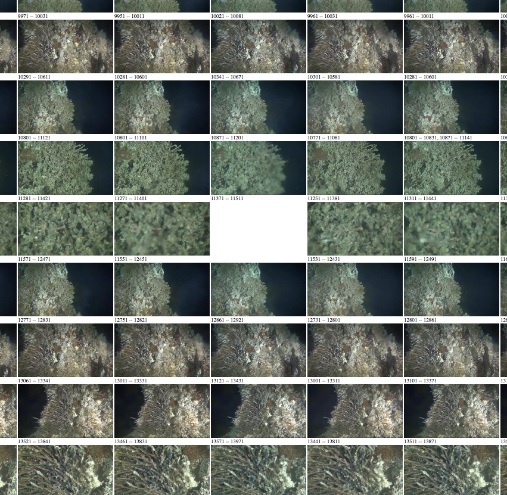

The script [`script/make_regions_proof_sheet.py`](../script/make_regions_proof_sheet.py) can be used to make a "Proof Sheets," an HTML page which shows a sample image from
each labelled static region in a set of files.

Each column is one video file, and each row is one static scene label.   
The script only deals with static regions (times when the camera isn't moving), and
always keeps regions within a file (columns) in chronological order -- in doing so it attempts to line up sequences of regions which are common to multiple files.   This can make it straightforward to identify regions which are missing or have been incorrectly labelled:

When the labelling of static regions in two files doesn't agree, it will attempt to rectify the situation by inserting blank space (in cases where one file has a particular region, but it has been missed or skipped in the other).

Unlabelled static regions are gathered at the bottom of the page.

# Correcting regions files

As the region files are JSON, they can be correct by hand.  For example, in the example
given above, the static region somewhere between frames 11511 and 12861 (the small numbers beneath the images) has not been labelled.      This can be manually corrected by first figuring out which
regions file is affected (scroll to the top of the proof sheet), opening the relevant regions
file in a text editor, and finding the relevant static section:

The unlabelled section can be seen in the middle of the image.   The word `"unknown"` can be edited
to the correct label, and the file saved.   Work can be checked by  

# Running the script

The script is written in Python.   It takes one or more `*_regions.json` files
as an input.  For example, to make a proof sheet of all of the files in one day, you might run (from the top level of this repo):

    python scripts/make_regions_proof_sheets RS03ASHS/PN03B/06-CAMHDA301/2017/02/15/*_regions.json

This collate all of the specific regions files, download all of the necessary frames, make thumbnails, and write the html to `_html/proof.html`.   

The HTML output can be set with the `--output` options, for example:

    python scripts/make_regions_proof_sheets --output _html/2017-02-15.html RS03ASHS/PN03B/06-CAMHDA301/2017/02/15/*_regions.json

The images are always stored in a subdirectory `images/` created in the same
directory as the HTML output.

## Dependencies

The script takes a whole raft of Python dependencies.   I believe the conda-format
file `scripts/requirements.yml` 

The one off-the-beaten path dependency is [pycamhd-lazycache](https://github.com/CamHD-Analysis/pycamhd-lazycache), which must be installed by hand with `pip`:

    https://github.com/CamHD-Analysis/pycamhd-lazycache.git
    cd pycamhd-lazycache
    pip install .
