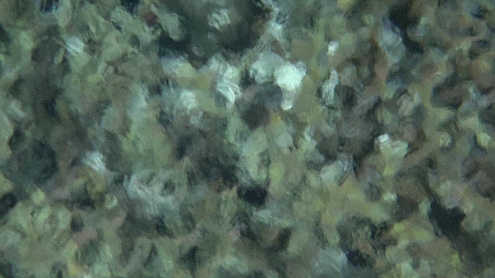
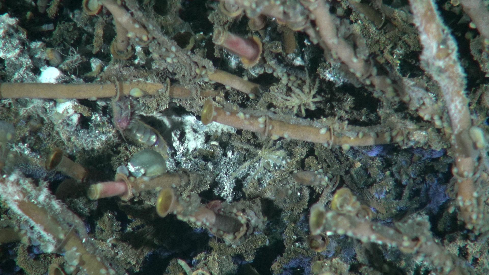
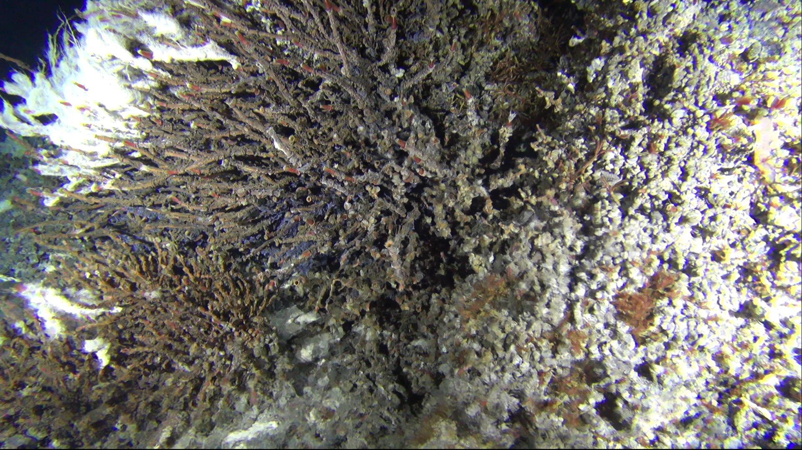

Each time CamHD is serviced or replaced, we call that a different "deployment".   While the camera is nominally put in the same place every time, there are minor differences in
the camera position, camera lighting, and even the camera behavior (one of them zooms faster than the other) which can confound matching.   When the camera is cycled, the biofouling is
cleared, which also introduces a step change in the appearance.

We also use the deployment number to track changes in collection routine.  For example, `d2` is the "standard" pre-programmed routine during the 2015-2016 deployment.   `d1` is the pre-history before the pre-programmed routine was codified, while `d3` is the "standard" preprogrammed routine during the 2016-2017 deployment.    The photometric difference between the two routines can be seen in this sample:

<table>
  <tr>
    <td> 
      CAMHDA301-20160725T210000Z, frame 5000</td>
    <td> 
      CAMHDA301-20160729T000000Z, frame 6000</td>
  </tr>
</table>

(note, these are not exactly the same scene (yet)....)

Since the pre-programmed routine is nominally the same between instances,
the `p` positions should be equivalent between deployments.

More details on the evolution of CamHD can be found in the [CamHD Biography](CamHD_Biography.md)

<table>
  <tr><th>Deployment</th>
      <th>Starts at</th>
      <th>Ends at</th>
  </tr>
  <tr><td>`d2`</td><td>2015/11/18/CAMHDA301-20151118T000020Z (approx)</td><td>2016/07/25/CAMHDA301-20160725T210000Z</td></tr>
  <tr><td>`d3`</td><td>2016/07/29/CAMHDA301-20160729T000000Z</td><td>2017/06/14/CAMHDA301-20170614T231900^</td></tr>
  <tr><td>`d4`</td><td>2017/08/14/CAMHDA301-20170814T211500</td><td>2017/11/13/CAMHDA301-20171113T211500^^</td></tr>
  <tr><td>[`d5`](Deployment_d5.md)</td><td>2018/07/04/CAMHDA301-20180704T.....</td><td>_Ongoing_</td></tr>
</table>

^ Deployment `d3` was cut short by a growing ground fault in June of 2016.

^^ Deployment `d4` suffered from ground faults almost immediately.  The camera was run in a degraded condition with one light through 13 November 2017, then was powered off.  See the [CamHD Biography](CamHD_Biography.md)

In both cases, the _camera_ was stopped but the _recording_ was not.   This resulted in  sequence of videos containing ~12 minutes of black.   These videos are readily identifiable as the black frame compress relatively well, with the Quicktime files at ~550MB in sie (versus 14GB).

# Regions

<table>
  <tr>
  <th>Name</th>
  <th>Action before</th>
  <th>Deployment `d2`</th>
  <th>Deployment `d3`</th>
  <th>Deployment `d4`</th>
  </tr>

  <tr>
    <td>d?_p1_z0</td>
    <td/>
    <td> </td>
    <td> </td>
    <td> </td>
  </tr>

  <tr>
    <td>d?_p1_z1</td>
    <td>Zoom In</td>
    <td> </td>
  </tr>

  <tr>
    <td>d?_p0_z0</td>
    <td>Zoom Out / Pan up (no break?)</td>
    <td> </td>
    <td> </td>
    <td> </td>
  </tr>

  <tr>
    <td>d?_p2_z0</td>
    <td>Pan Up/left</td>
    <td> </td>
    <td> </td>
    <td> </td>
  </tr>

  <tr>
    <td>d?_p2_z1</td>
    <td>Zoom in</td>
    <td> </td>
  </tr>

  <tr>
    <td>d?_p2_z2 (?)</td>
    <td>Zoom in</td>
    <td></td>
    <td> </td>
  </tr>

  <tr>
    <td>d?_p2_z0</td>
    <td>Zoom out</td>
    <td> </td>
    <td> </td>
  </tr>

  <tr>
    <td>d?_p0_z0</td>
    <td>Pan down/right</td>
    <td> </td>
    <td> </td>
    <td> </td>
  </tr>

  <tr>
    <td>d?_p3_z0</td>
    <td>Pan up</td>
    <td> </td>
    <td> </td>
    <td> </td>
  </tr>

  <tr>
    <td>d?_p3_z1</td>
    <td>Zoom in</td>
    <td> </td>
    <td></td>
    <td> </td>
  </tr>

  <tr>
    <td>d?_p3_z2</td>
    <td>Zoom in (further)</td>
    <td> </td>
    <td> </td>
    <td> </td>
  </tr>

  <tr>
    <td>d?_p3_z0</td>
    <td>Zoom out</td>
    <td> </td>
    <td> </td>
    <td> </td>
  </tr>

  <tr>
    <td>d?_p0_z0</td>
    <td>Pan down</td>
    <td> </td>
    <td> </td>
    <td> </td>
  </tr>

  <tr>
    <td>d?_p4_z0</td>
    <td>Pan up/right</td>
    <td> </td>
    <td> </td>
    <td> </td>
  </tr>

  <tr>
    <td>d?_p4_z1</td>
    <td>Zoom in</td>
    <td> </td>
    <td> </td>
    <td> </td>
  </tr>

  <tr>
    <td>d?_p4_z2</td>
    <td>Zoom in (further)</td>
    <td> </td>
    <td> </td>
    <td> </td>
  </tr>

  <tr>
    <td>d?_p4_z0</td>
    <td>Zoom out</td>
    <td> </td>
    <td> </td>
    <td> </td>
  </tr>

  <tr>
    <td>d?_p0_z0</td>
    <td>Pan down/left</td>
    <td> </td>
    <td> </td>
    <td> </td>
  </tr>

  <tr>
    <td>d?_p5_z0</td>
    <td>Pan right</td>
    <td> </td>
    <td> </td>
    <td> </td>
  </tr>

  <tr>
    <td>d?_p5_z1</td>
    <td>Zoom in</td>
    <td> </td>
    <td> </td>
    <td> </td>
  </tr>

  <tr>
    <td>d?_p5_z2</td>
    <td>Zoom in (further)</td>
    <td> </td>
    <td> </td>
    <td> </td>
  </tr>

  <tr>
    <td>d?_p5_z0</td>
    <td>Zoom out</td>
    <td> </td>
    <td> </td>
    <td> </td>
  </tr>

  <tr>
    <td>d?_p0_z0</td>
    <td>Pan left</td>
    <td> </td>
    <td> </td>
    <td> </td>
  </tr>

  <tr>
    <td>d?_p6_z0</td>
    <td>Pan left</td>
    <td> </td>
    <td> </td>
    <td> </td>
  </tr>

  <tr>
    <td>d?_p6_z1</td>
    <td>Zoom in</td>
    <td> </td>
    <td> </td>
    <td> </td>
  </tr>

  <tr>
    <td>d?_p6_z2</td>
    <td>Zoom in (further)</td>
    <td> </td>
    <td> </td>
    <td> </td>
  </tr>

  <tr>
    <td>d?_p6_z0</td>
    <td>Zoom out</td>
    <td> </td>
    <td> </td>
    <td> </td>
  </tr>

  <tr>
    <td>d?_p0_z0</td>
    <td>Pan right</td>
    <td> </td>
    <td> </td>
    <td> </td>
  </tr>

  <tr>
    <td>d?_p0_z1</td>
    <td>Zoom in</td>
    <td> </td>
    <td> </td>
    <td> </td>
  </tr>

  <tr>
    <td>d?_p0_z2</td>
    <td>Zoom in (further)</td>
    <td> </td>
    <td> </td>
    <td> </td>
  </tr>

  <tr>
    <td>d?_p0_z0</td>
    <td>Zoom out</td>
    <td> </td>
    <td> </td>
    <td> </td>
  </tr>

  <tr>
    <td>d?_p7_z0</td>
    <td>Pan down</td>
    <td> </td>
    <td> </td>
    <td> </td>
  </tr>

  <tr>
    <td>d?_p7_z1</td>
    <td>Zoom in</td>
    <td> </td>
    <td> </td>
    <td> </td>
  </tr>

  <tr>
    <td>d?_p7_z0</td>
    <td>Zoom out</td>
    <td> </td>
    <td> </td>
    <td> </td>
  </tr>

  <tr>
    <td>d?_p0_z0</td>
    <td>Pan up</td>
    <td> </td>
    <td> </td>
    <td> </td>
  </tr>

  <tr>
    <td>d?_p8_z0</td>
    <td>Pan right/down</td>
    <td> </td>
    <td> </td>
    <td> </td>
  </tr>

  <tr>
    <td>d?_p8_z1</td>
    <td>Zoom in</td>
    <td> </td>
    <td> </td>
    <td> </td>
  </tr>

  <tr>
    <td>d?_p8_z0</td>
    <td>Zoom out</td>
    <td> </td>
    <td> </td>
    <td> </td>
  </tr>

  <tr>
    <td>d?_p0_z0</td>
    <td>Pan up/left</td>
    <td> </td>
    <td> </td>
    <td> </td>
  </tr>

  <tr>
    <td>d?_p1_z0</td>
    <td>Pan down</td>
    <td> </td>
    <td> </td>
    <td> </td>
  </tr>

</table>
