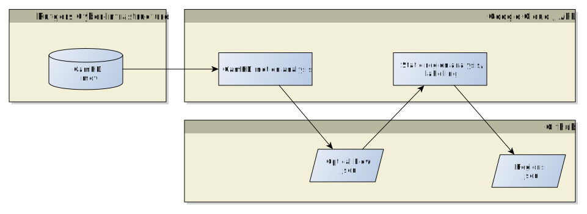
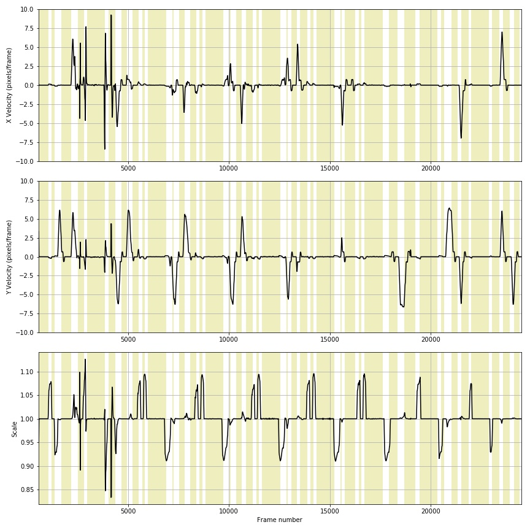

Twenty-Thousand Foot View
=========================

[CamHD](http://oceanobservatories.org/instrument-class/camhd/) is a HD camera installed on the
[Ocean Observatories Initiative](http://oceanobservatories.org) [Cabled Array](http://oceanobservatories.org).

_Credit: NSF-OOI/UW/ISS; Dive R1835; V15_

It comes on every three hours and captures a pre-programmed 12 minute sequence of pan, tilt, and zooms examining the
surface of Mushroom, an active hydrothermal vent on Axial Seamount.

This video is stored on shore as both Apple Prores ("Uncompressed HD") and H.264 / MP4, both on the [OOI RawData server](https://rawdata.oceanobservatories.org/files/RS03ASHS/PN03B/06-CAMHDA301/2017/11/14/).

When it came time to analyze this data, we ran into two big problems:

1. The uncompress data is too voluminous to download, but there is not processing attached to the
raw data server.

2. While the camera's motion is consistent between videos, the exact position of the camera
at a given time in a video can vary by quite a bit due to small timing difference, motion slop, etc.

This repository stores our solution to problem \#2.   We've gone through the "standard sequence" of camera moves and
labelled each of the times where the camera _isn't_ moving.   There are 42 of these "static regions"
in the camera motion, with some of them being repeated views of the same place.   Examples of each region can be found in [Regions.md](Regions.md).

# High Level

The overall processing is somewhat convoluted.  Here's a __very__ high level view:

CamHD ProRes files are delivered to the OOI Cyber-Infrastructure Rawdata server.

The [camhd-motion-analysis](https://github.com/CamHD-Analysis/camhd-motion-analysis) program
then analyzes the entire movie, estimating the camera motion (pan, tilt, zoom) throughout the whole movie:

The results of this analysis are stored in this repository as a [JSON file](Json_Optical_Flow_File_Format.md), one per movie.

This JSON file is then loaded by a [Python script](https://github.com/CamHD-Analysis/CamHD_motion_metadata/blob/master/scripts/make_regions_files.py) which finds the segments of each movie where the camera is believed to be static (the yellow bands in the image above).   Using a set of reference data files, it attempts to label each of those static segments using the naming scheme defined [here](Regions.md).  The result of this labelling is then stored as a separate [JSON file](Json_Regions_File_Format.md) in this repository, again, one per movie.   

This regions file can then be loaded and used for analysis.  We also provide a simple [Python module](https://github.com/CamHD-Analysis/pycamhd-motion-metadata) which provides a light OO wrapper around the JSON files.
